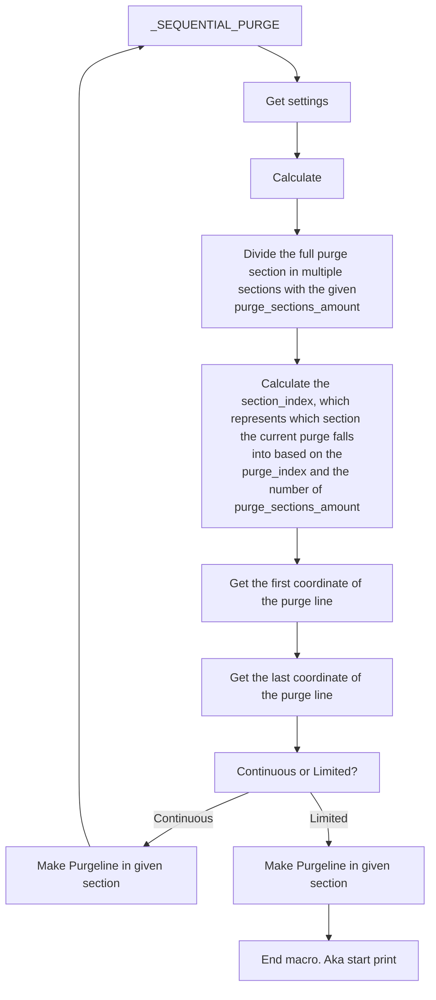

# BETA
# FOR ISSUES PING ME (danni_design) IN THE [DISCORD](https://discord.gg/xqpKrxt9FC) SERVER.

# Sequential Purging 

This incredible macro ensures you shall worry no more! Avoid problems caused by purge lines from previous prints that haven't been removed from the bed.


While the macro itself doesn't (and can't) remove the purge line from your bed automatically, it does provide a system by which the purge line is printed in avoidance of previous purges, remembering and avoiding the location of the purge lines in previous print jobs.

At the moment the macro can only purge on the front of the bed, not on the back or the left and right sides.

## Modes
### Continuous
In continuous mode the purge line gets drawn every print in an order and when the purge_sections_amount is full it will start back at the first purge section.
### Limited
In limited mode a purge line gets drawn every print and you dont have to worry about accidentally leaving the purge lines on the bed because the print will not start once the purge_sections_amount is full.

## Installation
1. Use `ssh` to open your printer's terminal, e.g. [Putty](https://www.putty.org/) and send these commands. 
   ```bash
    sudo apt-get update && sudo apt-get install git -y

    cd ~ && git clone https://github.com/Department-of-Design/Kevins-Awesome-Macros.git

    chmod 755 ./Kevins-Awesome-Macros/KAM-setup.sh 
    
    ./Kevins-Awesome-Macros/KAM-setup.sh
    ```
    Follow the onscreen instructions in the setup wizard.
    
2. Open your `moonraker.conf` file and add this configuration:
   ```yaml
   [update_manager Kevins-Awesome-Macros]
   type: git_repo
   channel: dev
   path: ~/Kevins-Awesome-Macros
   origin: https://github.com/Department-of-Design/Kevins-Awesome-Macros.git
   managed_services: klipper
   primary_branch: main
    ```
3. Add this to your printer.cfg.   
    ```yaml
    [include KAM-settings.cfg]
    ``` 
4. Restart your firmware by sending `FIRMWARE_RESTART`.
5. Send the macro `_INITIALIZE_PURGE` in your printers console to initialize the purge counting. This fortunately only has to be done once so you can forget about it afterwards.
6. Open `KAM-settings.cfg`.
Next go to the `Sequential Purging` section. 
    ```yaml
    [gcode_macro _KAM-settings]
    description: Settings for KAM macros


    ####################
    # Sequential Purging
    ####################


    # Continuous: where the purge line gets drawn every print in an order and when the purge_sections_amount is full it will start back at the first purge section.
    # Limited: draws a purge line every print and you dont have to worry about accidentally leaving the purgelines on the bed because the print will not start once the purge_sections_amount is full.
    # !! for the Limited mode you need CHECK_PURGES somewhere before the SEQUENTIAL_PURGE command in your PRINT_START macro. Preferably before your printer heats up so you don't waste the heating time. 
    # !! when the purge section is full you can use RESET_PURGES to clear the system and start at the first purge section on your next print.

    # set this to True if you want continuous, and to false if you want limited
    # default is True
    variable_continuous: True

    # this is only...
    ```

Here you can configure the settings for the macro. The most important setting is `variable_continuous`. With this you can select what [mode](https://github.com/Department-of-Design/Kevins-Awesome-Macros/tree/main/sequential_purge#modes) you want to use. For continuous you have to set `variable_continuous` to `True`.


> [!IMPORTANT]
> After making any changes in the config you will need to restart the firmware by using `FIRMWARE_RESTART` or the button in the UI. If you don't restart the firmware the changes will not have any effect.

## Configuration
| Setting                           | Description                                                                                                                                                                                                                                                                        | Input                                     | Default |
|-----------------------------------|------------------------------------------------------------------------------------------------------------------------------------------------------------------------------------------------------------------------------------------------------------------------------------|-------------------------------------------|---------|
| `variable_continuous`             | Setting for setting the mode you want to use.                                                                                                                                                                                                                                      | `True` (Continuous) <br>`False` (Limited) | `True`  |
| `variable_stop_print_on_warning`  | This is only needed on limited mode. This will stop the print if the purge section is full, if this is set to false it will echo a message to console instead of aborting the print.<br>This will also automatically reset the purges and continue printing. Use at your own risk. | `True`<br>`False`                         | `False` |
| `variable_warning_time`           | Time user has to remove purges                                                                                                                                                                                                                                                     | `0` to `3600`                             | `30`    |
| `variable_x_purge_offset`   | The distance the purge line is away from the bed in X on both sides. This will only (haven't tested this on any other printers) work on configurations where the 0,0 point is on the left bottom corner of the bed.                                                                    | `0` to `100`                              | `10`    |
| `variable_y_purge_offset`   | The distance the purge line is away from the bed in Y. This will only (haven't tested this on any other printers) work on configurations where the 0,0 point is on the left bottom corner of the bed.                                                                    | `0` to `100`                              | `3`    |
| `variable_purge_sections_amount`  | The amount of purge sections in the line.                                                                                                                                                                                                                                          | `0` to `20`                               | `5`     |
| `variable_purge_height`           | The distance from the bed for the purge line.                                                                                                                                                                                                                                      | Any number above `0`                      | `0.4`   |
| `variable_flow_rate`              | Flow rate for the purgeline, this will both be used to set the speed of the purge line and the amount of filament extruded so set this setting with caution. Many set this at their hotend flow limit or a little under that.                                                                                                                                                                                                             | Any number above `0`                      | `12`    |
| `variable_multiplier`           | Purge multiplier is for when you want more purge than stock offers. This will not increase the flow, it will slow down the purge and purge more material. purge line works from 100% to 500%. e.g. 150% more purge = 50% more                                                                                                                                                                                                                                                        | 100 to 500                      | `100`    |
| `variable_tip_distance`           | The distance between the tip of the filament and the nozzle before purging, should be similar to the final retract amount specified in PRINT_END.                                                                                                                                  | Any number above `0`                      | `10`    |
| `variable_purge_line_end_overlap` | Specifies the overlap of the purge line with the next purge line in percentage.                                                                                                                                                                                                    | Percentage from `0` to `100`              | `50`    |
| `min_temp_extrude` | temperature where filament can be extruder, will error below this temp.                                                                                                                                                                                                    | Temperature in Celcius             | `180`    |
## Macros in config

This package contain's 3 macros: `_SEQUENTIAL_PURGE`, `_CHECK_PURGES` and `_RESET_PURGES`.

For [continuous](https://github.com/Department-of-Design/Kevins-Awesome-Macros/blob/main/sequential_purge.md#continuous) mode you only need `_SEQUENTIAL_PURGE`. With the [limited](https://github.com/Department-of-Design/Kevins-Awesome-Macros/blob/main/sequential_purge.md#limited) mode you need all 3 the macros. 

Here's how your `PRINT_START` would look for both of them.

#### Continuous
```yaml
Home printer
Heat printer
(more print start stuff)
_SEQUENTIAL_PURGE
```
In the continuous mode you can just replace your purge with the SEQUENTIAL_PURGE command.
#### Limited
```yaml
_CHECK_PURGES
Home printer
Heat printer
(more print start stuff)
_SEQUENTIAL_PURGE
```
For the limited mode it's a little different, here you check if the purge section is full before the print start's so you don't heat the printer up to find out there's still purges.

## Usage (only when using limited mode)
When your purge section is full and you try to start a print, you'll notice you can't. This is because your printer knows the purge section is full and you'll have to remove all the purge lines and use the `_RESET_PURGES` command to let the printer know you've removed all purges. Now you can start a print again and be happily ever after. 

## Technical info
Here is a flowchart on how the macro performs.


## Uninstalling
That's unfortunate, is the macro not working for you? If you're having trouble you can either send me direct message on Discord @ danni_design or ping me in the KevinAkaSam's sandbox server. 

If you really wish to uninstall this macro you can do so opening the setup wizard by sending this in your printers command line.
```bash
cd ~ && ./KAM-setup.sh
```

and going to the Uninstall wizard (2) and follow the steps given.


If you don't have the setup wizard anymore you can manually send these commands in the command line.

```bash
cd
rm -rf Kevins-Awesome-Macros
rm printer_data/config/KAM-settings.cfg
rm printer_data/config/KAM/*
rmdir printer_data/config/KAM
```

And remove the following from your `printer.cfg`
```yaml
[include KAM-settings.cfg]
```

## Troubleshooting

<details>
    <summary>
        <b>
        I'm getting an error about save_variables!
        </b>
    </summary>
<p>
</p>
This happens because the macro already includes the `save_variable` section. To fix this remove the section in a place that is not sequential_purge.cfg. 
</details>

<details>
    <summary>
        <b>
        I'm getting the error `Error evaluating 'gcode_macro sequential_purge :gcode': jinja2.exceptions.UndefinedError:'dict object' has no attribute 'purge_index'`
        </b>
    </summary>
<p>
</p>
This error is caused by running an older version of Klipper, to resolve this either update your system or run RESET_PURGES.
</details>

<details>
    <summary>
        <b>
        I'm getting the error `Unkown command: "RESPOND"` when using the `_INITIALIZE_PURGES` command. 
        </b>
    </summary>
<p>
</p>
You will get this error if you don't have the `[respond]` section configured. You can do so by adding `[respond]` anywhere in your config. The easiest is to add it to your `printer.cfg`
</details>

## Credits
Huge thanks to [Kyleisah](https://github.com/kyleisah) for the amazing work on KAMP and for the inspiration for this macro.
