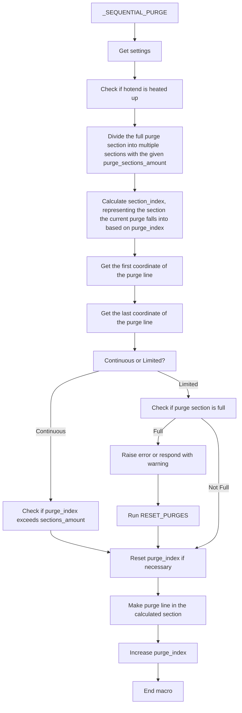

# BETA
For issues, ping me (danni_design) in the [Discord](https://discord.gg/xqpKrxt9FC) server.

# Sequential Purging

This incredible macro ensures you will worry no more about purge lines from previous prints that haven't been removed from the bed.


While the macro itself doesn't (and can't) remove the purge lines from your bed automatically, it provides a system that remembers the locations of previous purges and avoids them in future print jobs. This ensures new purge lines are printed in clean sections of the bed.

Currently, the macro can only purge on the front of the bed and does not support purging on the back, left, or right sides.

## Modes
### Continuous
In continuous mode, the purge line is drawn in sequence with every print. Once all purge sections are filled, the macro starts again from the first purge section.

### Limited
In limited mode, the purge line is drawn with every print. The print will not start once all purge sections are full, ensuring no accidental purge lines are left on the bed.

## Installation
1. Follow the instructions in the [Quick Install guide](https://github.com/Department-of-Design/Kevins-Awesome-Macros?tab=readme-ov-file#quick-install) and press `1` for `Install sequential purging` in the installation wizard. Once done, return to this page.

2. Edit your `moonraker.conf` file and add this configuration:
   ```yaml
   [update_manager Kevins-Awesome-Macros]
   type: git_repo
   channel: dev
   path: ~/Kevins-Awesome-Macros
   origin: https://github.com/Department-of-Design/Kevins-Awesome-Macros.git
   managed_services: klipper
   primary_branch: main
   ```

3. Add this to your `printer.cfg` file:
   ```yaml
   [include KAM-settings.cfg]
   ```

4. Restart your firmware by sending `FIRMWARE_RESTART`.

5. Send the macro `_INITIALIZE_PURGE` in your printer's console to initialize the purge counting. This only needs to be done once.

6. Open `KAM-settings.cfg` and navigate to the `Sequential Purging` section:
   ```yaml
   [gcode_macro _KAM-settings]
   description: Settings for KAM macros

   ####################
   # Sequential Purging
   ####################

   # Continuous: where the purge line gets drawn every print in an order and when the purge_sections_amount is full it will start back at the first purge section.
   # Limited: draws a purge line every print, and you don't have to worry about accidentally leaving the purge lines on the bed because the print will not start once the purge_sections_amount is full.
   # !! For Limited mode, you need CHECK_PURGES somewhere before the SEQUENTIAL_PURGE command in your PRINT_START macro. Preferably, place it before your printer heats up so you don't waste heating time.
   # !! When the purge section is full, you can use RESET_PURGES to clear the system and start at the first purge section on your next print.

   # Set this to True if you want continuous mode, and to False if you want limited mode.
   # Default is True
   variable_continuous: True

   # this is only...
   ```

Here, you can configure the settings for the macro. The most important setting is `variable_continuous`. This allows you to select the mode you want to use. For continuous mode, set `variable_continuous` to `True`. For limited mode, set it to `False`. You can read more about the modes [here](https://github.com/Department-of-Design/Kevins-Awesome-Macros/tree/main/sequential_purge#modes).


> [!IMPORTANT]
> After making any changes in the config you will need to restart the firmware by using `FIRMWARE_RESTART` or the button in the UI. If you don't restart the firmware the changes will not have any effect.

## Configuration
| Setting                           | Description                                                                                                                                                                                                                                                                        | Input                                     | Default |
|-----------------------------------|------------------------------------------------------------------------------------------------------------------------------------------------------------------------------------------------------------------------------------------------------------------------------------|-------------------------------------------|---------|
| `variable_continuous`             | Setting for the mode you want to use.                                                                                                                                                                                                                                           | `True` (Continuous) <br>`False` (Limited) | `True`  |
| `variable_stop_print_on_warning`  | This is only needed in limited mode. This will stop the print if the purge section is full; if set to false, it will echo a message to the console instead of aborting the print. This will also automatically reset the purges and continue printing. Use at your own risk. | `True`<br>`False`                         | `False` |
| `variable_warning_time`           | Time the user has to remove purges                                                                                                                                                                                                                                               | `0` to `3600`                             | `30`    |
| `variable_x_purge_offset`         | The distance the purge line is away from the bed in X on both sides. This will only (not tested on other printers) work on configurations where the 0,0 point is on the left bottom corner of the bed.                                                                          | `0` to `100`                              | `10`    |
| `variable_y_purge_offset`         | The distance the purge line is away from the bed in Y. This will only (not tested on other printers) work on configurations where the 0,0 point is on the left bottom corner of the bed.                                                                                       | `0` to `100`                              | `3`     |
| `variable_purge_sections_amount`  | The amount of purge sections in the line.                                                                                                                                                                                                                                          | `0` to `20`                               | `5`     |
| `variable_purge_height`           | The distance from the bed for the purge line.                                                                                                                                                                                                                                      | Any number above `0`                      | `0.4`   |
| `variable_flow_rate`              | Flow rate for the purge line; this will set the speed of the purge line and the amount of filament extruded, so set this carefully. Many set this at their hotend flow limit or slightly below that.                                                                               | Any number above `0`                      | `12`    |
| `variable_multiplier`             | Purge multiplier is for when you want more purge than stock offers. This will not increase the flow but will slow down the purge and use more material. The purge line works from 100% to 500%. For example, 150% more purge = 50% more.                                           | 100 to 500                                | `100`   |
| `variable_tip_distance`           | The distance between the tip of the filament and the nozzle before purging. It should be similar to the final retract amount specified in PRINT_END.                                                                                                                               | Any number above `0`                      | `10`    |
| `variable_purge_line_end_overlap` | Specifies the overlap of the purge line with the next purge line in percentage.                                                                                                                                                                                                    | Percentage from `0` to `100`              | `50`    |
| `min_temp_extrude`                | Temperature below which filament cannot be extruded. An error will occur if this temperature is not reached.                                                                                                                                                                      | Temperature in Celsius                     | `180`   |
## Macros in config

This package contain's 3 macros: `_SEQUENTIAL_PURGE`, `_CHECK_PURGES` and `_RESET_PURGES`.

For [continuous](https://github.com/Department-of-Design/Kevins-Awesome-Macros/tree/main/sequential_purge#continuous) mode you only need `_SEQUENTIAL_PURGE`. With the [limited](https://github.com/Department-of-Design/Kevins-Awesome-Macros/tree/main/sequential_purge#limited) mode you need all 3 the macros. 

Here's how your `PRINT_START` would look for both of them.

#### Continuous
```yaml
Home printer
Heat printer
(more print start stuff)
_SEQUENTIAL_PURGE
```
In the continuous mode you can just replace your purge with the SEQUENTIAL_PURGE command.
#### Limited
```yaml
_CHECK_PURGES
Home printer
Heat printer
(more print start stuff)
_SEQUENTIAL_PURGE
```
For the limited mode it's a little different, here you check if the purge section is full before the print start's so you don't heat the printer up to find out there's still purges.

## Usage (only when using limited mode)
When your purge section is full and you try to start a print, you'll notice you can't. This is because your printer knows the purge section is full and you'll have to remove all the purge lines and use the `_RESET_PURGES` command to let the printer know you've removed all purges. Now you can start a print again and be happily ever after. 

## Technical info
Here is a flowchart on how the macro performs.


## Uninstalling
That's unfortunate! Is the macro not working for you? If you're having trouble, feel free to send me a direct message on Discord (@danni_design) or ping me in KevinAkaSam's Sandbox server.

If you still wish to uninstall the macro, you can do so by opening the setup wizard with the following command in your printer's command line:
```bash
cd ~ && ./KAM-setup.sh
```
Navigate to the **Uninstall** menu (option 2) and follow the steps provided.

If you no longer have the setup wizard, you can manually uninstall KAM by entering these commands in the command line:

```bash
cd
rm -rf Kevins-Awesome-Macros
rm printer_data/config/KAM-settings.cfg
rm printer_data/config/KAM/*
rmdir printer_data/config/KAM
```

Additionally, remove the following from your `printer.cfg` file:
```yaml
[include KAM-settings.cfg]
```

## Troubleshooting

<details>
    <summary>
        <b>
        I'm getting an error about save_variables!
        </b>
    </summary>
<p>
This happens because the macro already includes the `save_variables` section. To fix this, remove the conflicting section from a location other than `sequential_purge.cfg`.
</p>
</details>

<details>
    <summary>
        <b>
        I'm getting the error `Error evaluating 'gcode_macro sequential_purge :gcode': jinja2.exceptions.UndefinedError: 'dict object' has no attribute 'purge_index'`
        </b>
    </summary>
<p>
This error is caused by running an older version of Klipper. To resolve it, either update your system or run the `RESET_PURGES` command.
</p>
</details>

<details>
    <summary>
        <b>
        I'm getting the error `Unknown command: "RESPOND"` when using the `_INITIALIZE_PURGES` command.
        </b>
    </summary>
<p>
This error occurs if you don't have the `[respond]` section configured. To fix it, add `[respond]` anywhere in your configuration file, preferably in `printer.cfg`.
</p>
</details>

## Credits
Huge thanks to [Kyleisah](https://github.com/kyleisah) for the amazing work on KAMP and for the inspiration behind this macro.