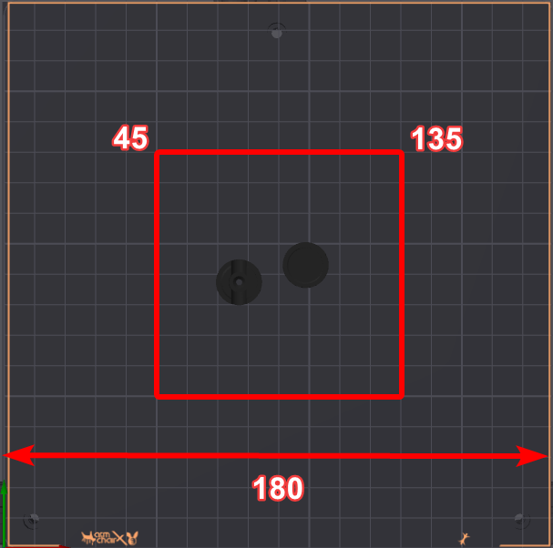
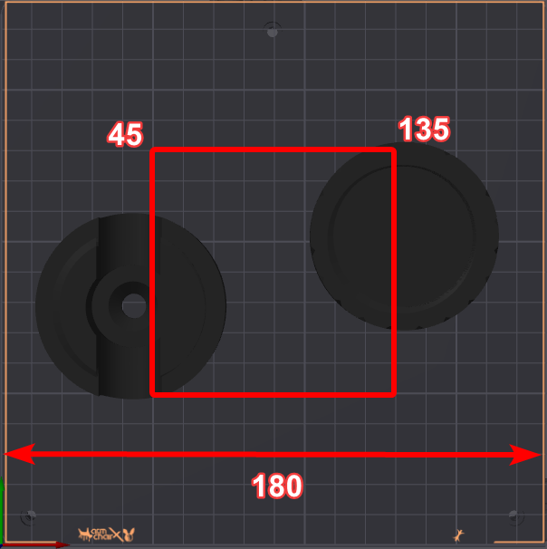

# Wait for bed edge to reach temp

This simple macro is for printers that have a temperature sensor at the edge of the bed to check whether the whole bed is heated. For example aluminum beds heat faster at the center and take some time to heat at the edges. 

This macro checks the size of the part your printing and if it crosses a certain border around the center of the bed it will wait for the edges to heat so you dont unnecessarily heat the whole bed for a small print.

An example for a `BOUND` of `50` it will regularly heat the bed to the target temp and start the print.


In the following case the parts cross the border and the printer will heat to the target temp and wait for the edge of the bed to reach the `MINIMUM_TEMP_THRESHOLD` which was set to `0.8` so if your bed is set to `110°C` that would be `88°C`


## Installation

1. **Naming the Temperature Sensor:**
   - Make sure your sensor is named exactly `bed_edge` in the configuration file.
   - Example:
     ```plaintext
     [temperature_sensor bed_edge]
     sensor_type: NTC 100K MGB18-104F39050L32
     sensor_pin: PC3
     ```

2. **Configuring `exclude_object`:**
   - This is required for excluding parts of prints if needed. There's more info [here](https://www.klipper3d.org/Exclude_Object.html).

3. **Installing the Macro:**
   - Run the [Quick Install guide](https://github.com/Department-of-Design/Kevins-Awesome-Macros?tab=readme-ov-file#quick-install) and, when prompted, select option `2` to install the "wait for bed edge temp" macro.

4. **Restart the Firmware:**
   - After installing, restart by typing `FIRMWARE_RESTART` in the terminal/console.

5. **Add Macro to Your Start Sequence:**
   - Edit the `PRINT_START` macro in your configuration (`printer.cfg`).
   - Add the line:
     ```plaintext
     WAIT_FOR_BED_EDGE_TEMP BED={BED} MINIMUM_TEMP_THRESHOLD=0.8 BOUND=50
     ```
   - This macro replaces your current bed heating command.
    Here's an example to what it might look like. Don't directly copy this entire print start macro.

   ```yaml
    [gcode_macro PRINT_START]
    gcode:
        
        
        WAIT_FOR_BED_EDGE_TEMP BED={BED_TEMP} MINIMUM_TEMP_THRESHOLD=0.8 BOUND=50
        # Use absolute coordinates
        G90
        # Home the printer
        G28
    ...

6. **Tweak Threshold Values if Needed:**
   - `MINIMUM_TEMP_THRESHOLD` and `BOUND` have default values but can be adjusted if necessary.

## Uninstalling
That's unfortunate! Is the macro not working for you? If you're having trouble, feel free to send me a direct message on Discord (@danni_design) or ping me in KevinAkaSam's Sandbox server.

If you still wish to uninstall the macro, you can do so by opening the setup wizard with the following command in your printer's command line:
```bash
cd ~ && ./KAM-setup.sh
```
Navigate to the **Uninstall** menu (option 2) and follow the steps provided.

If you no longer have the setup wizard, you can manually uninstall KAM by entering these commands in the command line:

```bash
cd
rm -rf Kevins-Awesome-Macros
rm printer_data/config/KAM-settings.cfg
rm printer_data/config/KAM/*
rmdir printer_data/config/KAM
```

Additionally, remove the following from your `printer.cfg` file:
```yaml
[include KAM-settings.cfg]
```

## Troubleshooting

<details>
    <summary>
        <b>
        I'm getting an error about an unknown sensor!
        </b>
    </summary>
<p>
This is because your temperature sensor does not have the right name assigned. Please call it `bed_edge`. Refer to the installation for more info https://github.com/Department-of-Design/Kevins-Awesome-Macros/tree/main/wait_for_bed_edge#installation</p>
</details>

## Credits
Huge thanks to [Kyleisah](https://github.com/kyleisah) for the amazing work on KAMP and for the inspiration behind this macro.